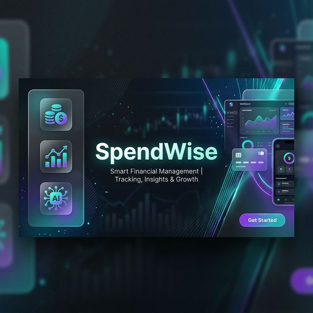

# SpendWise - Ứng dụng Quản lý Tài chính Thông minh 🚀



### 🚀 [Trải nghiệm ứng dụng tại đây: spendwise5.vercel.app](https://spendwise5.vercel.app/)


SpendWise là một ứng dụng web hiện đại, được thiết kế để giúp cá nhân quản lý tài chính một cách khoa học, hiệu quả và tự động. Ứng dụng tích hợp các công nghệ tiên tiến nhất như Next.js 15, Prisma, OCR (Nhận diện ký tự quang học) và Trí tuệ nhân tạo (Gemini AI).

---

## ✨ Tính năng nổi bật

### 🏦 Quản lý Tài sản Đa năng
- Quản lý đồng thời nhiều ví và tài khoản ngân hàng.
- Theo dõi số dư thực tế theo thời gian thực.
- Chuyển khoản nội bộ giữa các ví linh hoạt.

### 📸 Quét Hóa đơn Thông minh (OCR)
- Tích hợp công nghệ **Tesseract.js**.
- Tự động bóc tách số tiền, ngày tháng và tên cửa hàng từ ảnh chụp hóa đơn.
- Giảm thiểu 90% thời gian nhập liệu thủ công.

### 🤖 Cố vấn Tài chính AI (Gemini AI)
- Sử dụng **Google Gemini AI** để phân tích thói quen chi tiêu.
- Đưa ra lời khuyên tài chính cá nhân hóa dựa trên dữ liệu thực tế.
- Cảnh báo các rủi ro vung tay quá trán.

### 📊 Báo cáo & Phân tích chuyên sâu
- Biểu đồ Dashboard trực quan (Pie Chart, Bar Chart).
- Phân tích xu hướng thu chi hàng tháng (MoM - Month over Month).
- Bản đồ giao dịch (Transaction Map) dựa trên vị trí địa lý.

### 🎯 Ngân sách & Mục tiêu
- Thiết lập hạn mức chi tiêu cho từng danh mục (Ăn uống, Mua sắm...).
- Theo dõi mục tiêu tiết kiệm với thanh tiến độ trực quan.

---

## 🛠 Công nghệ sử dụng

| Công nghệ | Vai trò |
|-----------|---------|
| **Next.js 15** | Framework chính (App Router & Server Actions) |
| **Prisma** | ORM cho PostgreSQL |
| **Tailwind CSS** | Giao diện Responsive & Modern |
| **Shadcn UI** | Bộ Component chuẩn Premium |
| **NextAuth.js** | Xác thực người dùng bảo mật |
| **Tesseract.js** | Xử lý OCR phía Client |
| **Gemini AI** | Phân tích và tư vấn tài chính |
| **Recharts** | Hiển thị biểu đồ thống kê |

---

## 🚀 Hướng dẫn cài đặt & Chạy dự án

### 1. Chuẩn bị môi trường
- Node.js 18.x trở lên
- PostgreSQL Database (Neon DB hoặc Local)

### 2. Clone project
```bash
git clone https://github.com/dien127/APP-Quan-Ly-Chi-Tieu.git
cd APP-Quan-Ly-Chi-Tieu
```

### 3. Cài đặt dependencies
```bash
npm install
```

### 4. Cấu hình biến môi trường
Tạo file `.env` tại thư mục gốc từ file `.env.example`:
```env
DATABASE_URL="postgres://..."
NEXTAUTH_SECRET="your-secret"
NEXTAUTH_URL="http://localhost:3000"
GEMINI_API_KEY="your-api-key"
```

### 5. Khởi tạo Database
```bash
npx prisma db push
```

### 6. Chạy môi trường phát triển
```bash
npm run dev
```

---

## 📂 Cấu trúc thư mục

```text
APP-Quan-Ly-Chi-Tieu/
├── prisma/             # Cấu hình Schema & Migrations
├── public/             # Assets tĩnh, icons, banner
├── src/
│   ├── app/            # Next.js App Router (Pages & Actions)
│   ├── components/     # UI Components (Custom & Shadcn)
│   ├── lib/            # Shared Utilities (Prisma, Auth)
│   └── proxy.ts        # Middleware & Auth logic
├── .gitignore          # Cấu hình bỏ qua các file không cần thiết
├── package.json        # Dependencies & Scripts
└── README.md           # Tài liệu hướng dẫn dự án
```

---

## 👥 Nhóm thực hiện - Nhóm Tất Tay Ra Trường

| STT | Họ và Tên | Vai trò chính |
|:---:|:----------|:--------------|
| 1 | **Hoàng Hữu Điền** | Nhóm trưởng, Backend, Database |
| 2 | **Ninh Văn Dũng** | UI/UX Designer, Frontend |
| 3 | **Nguyễn Đình Hào** | Database, Deployment, Auth |
| 4 | **Báo Ngọc Thiên Bảo** | AI Integration, OCR, Testing |
| 5 | **Trần Quốc Lâm** | Documentation, PWA, Features |

---

## 📈 Lịch sử phát triển & Cam kết

Dự án được xây dựng với mục tiêu đạt chuẩn **Premium Fintech Application**. Chúng tôi cam kết duy trì mã nguồn sạch, cấu trúc rõ ràng và lịch sử commit logic để phục vụ quá trình bảo trì và phát triển lâu dài.

---
© 2026 SpendWise Team. Developed for Final Term Project.
